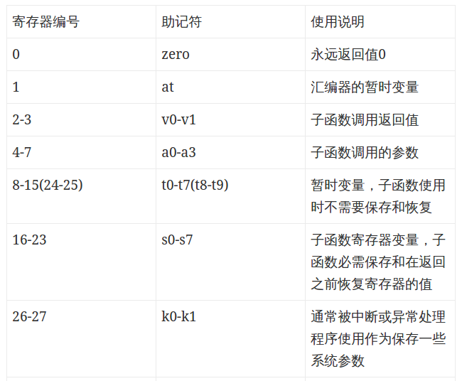
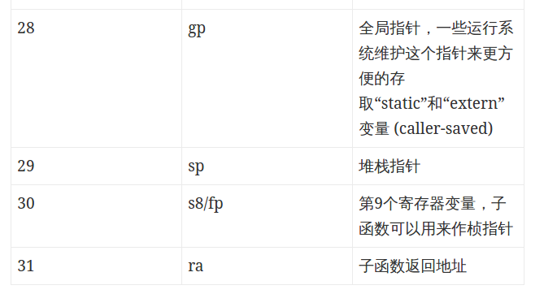

[TOC]

## 第二章：指令：计算机的语言

### MIPS操作数

+ 寄存器
  - `$s0-$s7` `$t0-$t9` `$a0-$a3` `$v0-v1` `$zero(恒为零)` `$gp` `$fp` `$sp` `$ra` `$at(为构造32位立即数保留)`
  - 只有存在寄存器的数据能进行算术计算操作
+ 2^30个存储字
  - `Memory[0]  Memory[4]  Memory[8]  ...  Memory[4294967292]`
  - 只能通过数据传输指令访问
  - MIPS使用**字节编址**
  - 用于保存数据结构 数组 和 溢出的寄存器

------

### MIPS指令表

在MIPS架构中，指令被分为三种类型：R型、I型和J型。三种类型的指令的最高6位均为6位的操作码。从25位往下，  

+ R型指令用连续三个5位二进制码来表示三个寄存器的地址，然后用一个5位二进制码来表示移位的位数（如果未使用移位操作，则全为0），最后为6位的function码（它与opcode码共同决定R型指令的具体操作方式）；
+ I型指令则用连续两个5位二进制码来表示两个寄存器的地址，然后是一个16位二进制码来表示的一个立即数二进制码；
+ J型指令用26位二进制码来表示跳转目标的指令地址（实际的指令地址应为32位，其中最低两位为00，高四位由PC当前地址决定）。

三种类型的指令图示如下：


其中 `rs`是操作数1的寄存器 `rt`是操作数2的寄存器 `rd`是存放结果的寄存器 `shamt`是位移量 `funct`是功能码 `immediate`是立即数 `address`是地址

以下是指令表


------

### MIPS程序举例

1. 条件分支

```shell

bne  $S3,$S4,Else
add  $S0,$S1,$S2
j    Exit
Else : sub $S0,$S1,$S2
Exit
```
2. 循环

```java
while (A[i] == B) {
	i++;
}
```
```shell

Loop: sll $t1,$s3,2 	  # 临时变量 $t1 = i*4 这是为了计算A[i]的地址
add $t1，$t1,$s6    	  	 # s6是&A[0] t1是&A[i]
lw $t0,0($t1)             # $t0 = A[i]
bne $t0,$s5,Exit          # 不相等时跳出
addi $s3,$s3,1            # i++
j Loop
Exit
```

### MIPS里的函数调用（过程）
#### 寄存器和指令约定
1. `$a0 ~ $a3` 用于存放四个参数
2. `$v0 ~ $v1` 用于存放两个返回值
3. `$ra` 用于存放返回地址 即调用地址的PC+4
4. `jal` 后面跟地址表示调用该地址的函数 用 `jr $ra`返回
5. 被调用者想要用一些寄存器必须用栈结构——把寄存器的旧值压栈，以便腾出寄存器用，最后出栈恢复。
6. `$sp`是栈指针。压栈`$sp -= 4 * n`  出栈`$sp += 4 * n`
7. `$t0 ~ $t9` 是存放临时值的 不需要被调用者保存
8. `$s0 ~ $s7` 被调用者要负责保存和恢复现场的寄存器
9. 嵌套调用的话 `$ra` 和参数寄存器之类可能互相覆盖，因此所有可能被覆盖的寄存器压栈，有必要的话，调用者会保存的会包括调用后还需要的`$a0 ~ $a3`和`$t0 ~ $t9`，被调用者会保存的包括`$ra`和被调用者使用的`$s0 ~ $s7` (**因此迭代比递归性能高很多**)
10. 多于4个参数的情况，可以将额外参数放在栈指针上方。

#### 寄存器编号表




### MIPS里的寻址

#### 32位立即数

+ MIPS里有个lui指令，可以用于设置寄存器的高16位，然后后续指令进行一次或运算就可以为低16位赋值。
+ 汇编器为了创建32位常数，保留了`$at`寄存器，来作为临时的寄存器。

#### 操作数寻址模式

1. 立即数寻址：操作数是立即数，来自指令
2. 寄存器寻址：操作数是寄存器
3. 基址寻址：操作数在内存中，其地址是常数与基址寄存器的和。
4. PC相对寻址：操作数的地址是PC和指令中的常数和
5. 伪直接寻址：操作数地址（跳转地址）是26位字段和PC高位相连

### 汇编器与伪指令

汇编器会将伪指令翻译为正式指令

#### 举例

1. `move $t0, $t1` 转译为 `add $t0, $zero, $t1`
2. `blt` 转译为 `slt bne`    (其他同样的例子:`bgt` `bge` `ble` )
3. `la`  是 load address  比如 `la`	`$t0`, `var1`
4. `li` 是 load immediate 比如 `li`  `$1`, `0x3BF20`

