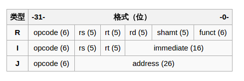
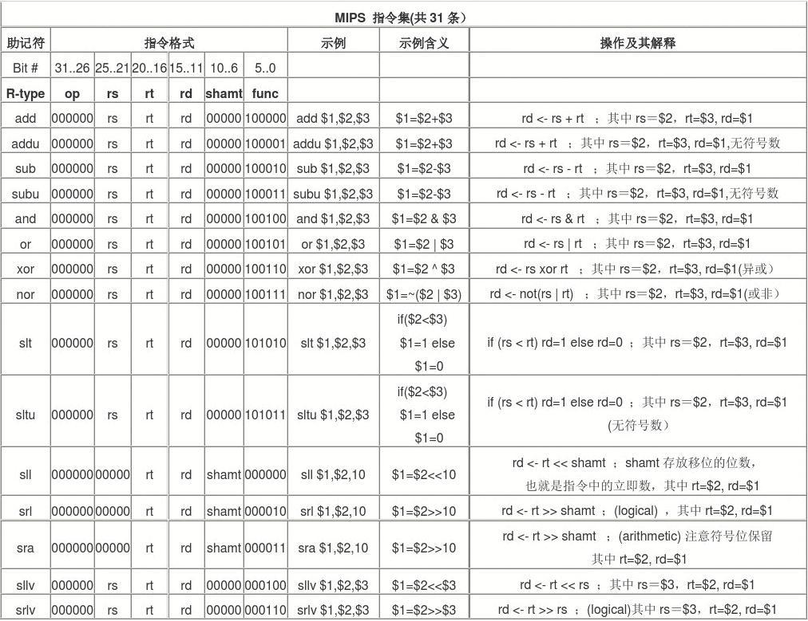
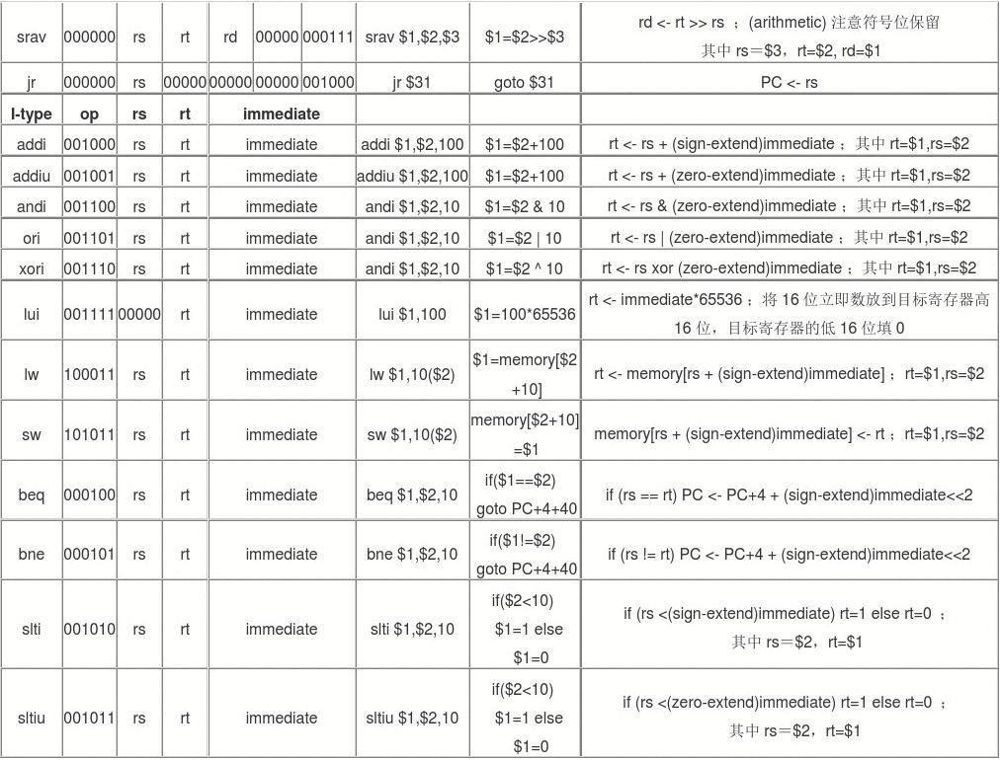
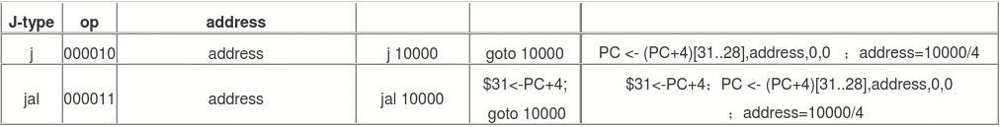

## 指令：计算机的语言

### MIPS操作数

+ 寄存器
	- `$s0-$s7` `$t0-$t9` `$a0-$a3` `$v0-v1` `$zero(恒为零)` `$gp` `$fp` `$sp` `$ra` `$at(为构造32位立即数保留)`
	- 只有存在寄存器的数据能进行算术计算操作
+ 2^30个存储字
	- `Memory[0]  Memory[4]  Memory[8]  ...  Memory[4294967292]`
	- 只能通过数据传输指令访问
	- MIPS使用**字节编址**
	- 用于保存数据结构 数组 和 溢出的寄存器

------

### MIPS指令表

在MIPS架构中，指令被分为三种类型：R型、I型和J型。三种类型的指令的最高6位均为6位的opcode码。从25位往下，  

+ R型指令用连续三个5位二进制码来表示三个寄存器的地址，然后用一个5位二进制码来表示移位的位数（如果未使用移位操作，则全为0），最后为6位的function码（它与opcode码共同决定R型指令的具体操作方式）；
+ I型指令则用连续两个5位二进制码来表示两个寄存器的地址，然后是一个16位二进制码来表示的一个立即数二进制码；
+ J型指令用26位二进制码来表示跳转目标的指令地址（实际的指令地址应为32位，其中最低两位为00，高四位由PC当前地址决定）。

三种类型的指令图示如下：

其中 `rs`是操作数1的寄存器 `rt`是操作数2的寄存器 `rd`是存放结果的寄存器 `shamt`是位移量 `funct`是功能码 `immediate`是立即数 `address`是地址

以下是指令表

------

