[TOC]

# 第四章：处理器

## 4.1 引言

### 一个基本的MIPS实现

本章我们将要实现MIPS指令集的核心子集：

+ 存储器访问指令：取字指令`lw`，存字指令`sw`
+ 算术逻辑指令(R-type)：`add`、`sub`、`and`、`or`、`slt`(小于则设置)
+ 分支指令(branch)：`beq`、`j`等等

### MIPS指令的执行过程

+ 前两步（各指令一样）：

  1. PC  在指令所在的存储单元取出指令

  2. Register numbers  根据寄存器的编号从寄存器文件读取寄存器内容
+ 后续操作与指令类型有关:
  1. 利用ALU（除了跳转指令外）
     1. 算数逻辑指令的计算
     2. 存储访问指令的访存地址计算
     3. 分支指令的条件判定计算
  2. 存储访问指令进行内存的读或写操作：取字指令读入的内存单元值/算术逻辑指令将`ALU`结果  写入结果寄存器
  3. PC=PC + 4 或  PC=跳转目标地址

### CPU抽象视图

+ 整体视图

  

+ 算术逻辑指令

   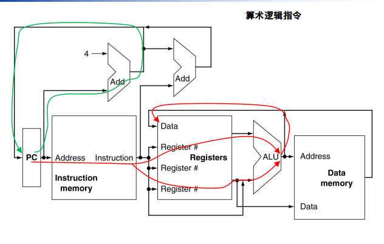

+ 存储访问指令

   

+ 分支控制指令

   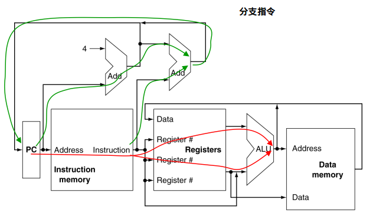

+ 复选器的使用

   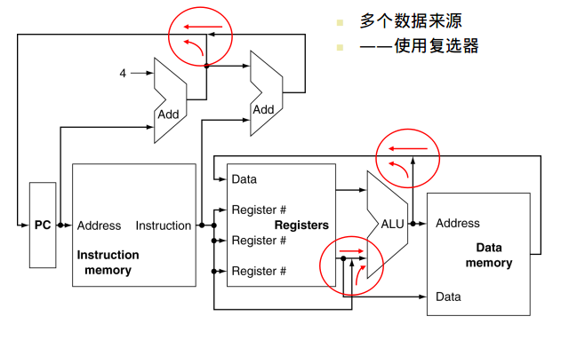

+ 控制信号的使用（决定了是什么指令）

   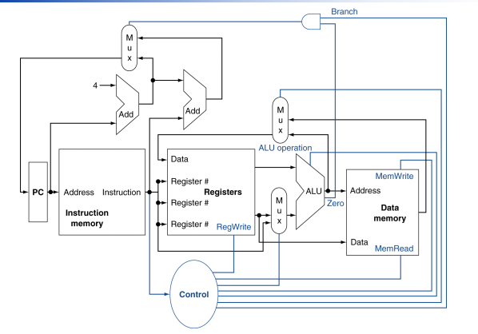

## 4.2 逻辑设计的一般方法

### 基本概念

+ 处理数据值的单元叫做逻辑组合单元，输出仅仅取决于输入，一般是操作单元。
  + 比如：加法器，乘法器，与门等等
+ 其他单元是包含状态的非组合单元，称之为状态单元，也叫时序逻辑单元，一般是存储单元。
  + 比如：寄存器，存储器
  + 一个状态单元至少有两个输入（数据值和时钟信号）和一个输出。时钟信号决定了何时可以写入，而状态单元是随时可读的。
  + 时钟方法规定了信号可写时间，这非常重要，因为我们需要防止读写冲突。
  + 边沿触发时钟：一种所有状态在时间沿才能发生改变的时钟方法机制。
  + 本章假定所有的变化都是在时钟的上升沿发生的。
  + 我们还可以引入控制信号（有效、无效），只有遇到时间沿并且控制信号有效的时候，状态单元才发生变化。

### 时钟方法

+ 从一个状态单元获取输入，结果输出到另一个状态单元
+ 组合电路完成变换的时间不大于时钟周期

## 4.3 建立数据通路

### 基本概念

+ 数据通路部件：用来操作或者存储的单元，MIPS中有指令存储器、数据存储器、寄存器堆、ALU和加法器。
+ 程序计数器（PC）：存放下一条指令的地址的寄存器。
+ 关于寄存器堆：
  + 需要输入的信号：要读的寄存器号（两个）、要写的寄存器号、数据值
  + ALU有两个32位输入和一个32位输出，还有一个1位的输出（指示结果是否为0）

### 两种数据通路

 #### R型和存取指令

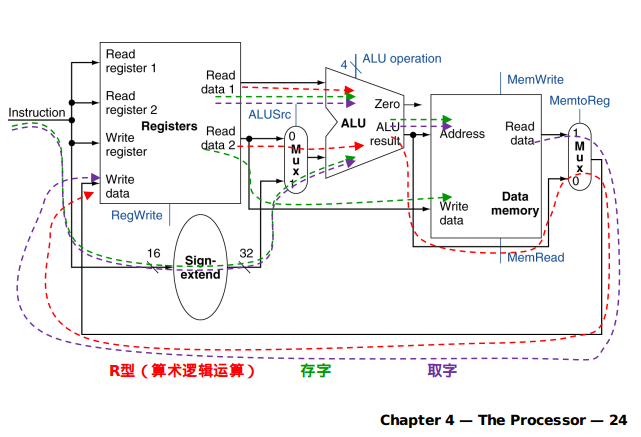

#### 跳转指令

 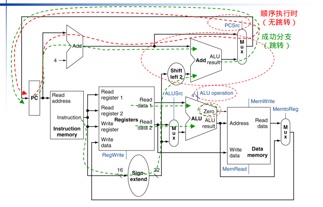

## 4.4 控制单元

### 4.4.1 ALU控制

ALU用途：

+ Load/Store:    F = add	求（基址+偏移）
  + Branch:           F = subtract求差 已获得标志位
+ R-type:            F 取决于指令的funct字段(见下表) 

| ALU控制信号 |  功能  | ALU控制信号 |  功能   |
| :-----: | :--: | :-----: | :---: |
|  0000   |  与   |  0110   |   减   |
|  0001   |  或   |  0111   | 小于则置位 |
|  0010   |  加   |  1100   |  或非   |

+ 使用一个控制单元即可生成4位的**ALU控制信号**，它的输入是
  + 指令的`funct`(6位)字段
  + `ALUOp`(2位)字段，为00是加，01是减去，10由`funct`决定

+ 下表展示了全部的转换

   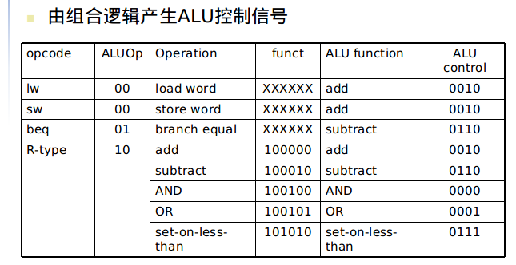

+ ALU真值表（上表的简洁化表示）

   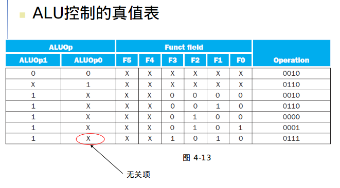

### 4.4.2 主控制单元的设计

#### 三种指令的格式

MIPS指令遵从下列约定

+ 31-26位 `Op`字段，也就是操作码 记作`Op[5:0]`
+ 两个被读取的寄存器`rs`和`rt`分别在25:21位和20:16位
+ 存取指令的基址在`rs`中 16位偏移量在`address(15:0)`中
+ beq分支指令的16位偏移量在`address(15:0)`中
+ 对于R型指令，目标寄存器在`rd`中，对于取数指令，在`rt`中，这里需要设计一个复选器来指明目标寄存器在哪个段

#### 设计图

  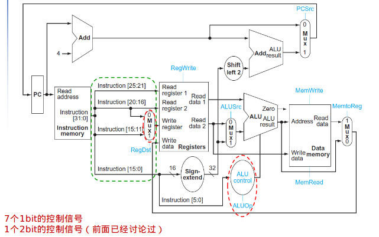

|     英文     |  中文  |     英文      |  中文  |
| :--------: | :--: | :---------: | :--: |
| Instrution |  指令  |     mux     | 多选器  |
|    zero    | 零标志  | sign-extend | 符号扩展 |

7个控制信号如下（2位的是ALUOp）（funct字段决定使用这7个的哪些）

|   信号名    |               无效时的含义                |                有效时的含义                |
| :------: | :---------------------------------: | :----------------------------------: |
|  RegDst  | 写寄存器操作的目标寄存器号来源于指令rt字段(bits 20:16). | 写寄存器操作的目标寄存器号来源于指令的rd字段(bits 15:11). |
| RegWrite |                  无                  |               寄存器堆写使能                |
|  ALUSrc  |        ALU第二个输入来源于寄存器堆的第二个输出        |     ALU第二个输入来源于指令的低16位（目标地址的偏移量）     |
|  PCSrc   |           顺序执行，取 PC + 4.            |           跳转，使用目标地址替代PC+4            |
| MemRead  |                  无                  |               数据存储器读使能               |
| MemWrite |                  无                  |               数据存储器写使能               |
| MemtoReg |           写入寄存器的值来源于ALU.            |           写入寄存器的值来源于数据存储器            |

注：除了PCsrc外，其他信号都可以在指令读入后通过操作码的译码就可以确定如果是beq则将比较结果确定后才能生成PCsrc

各类指令需要的的控制信号 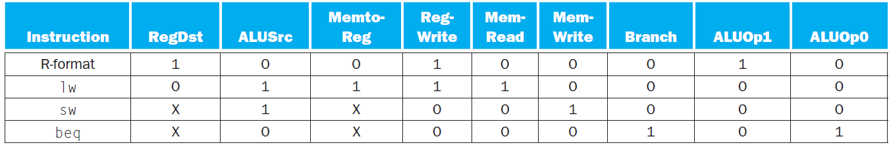

归类记忆：7个1bit的控制信号:     3个mux控制，3个寄存器/内存读写控制信号，1个分支branch

 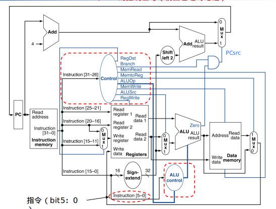

#### R型指令（紫色没有路过）

 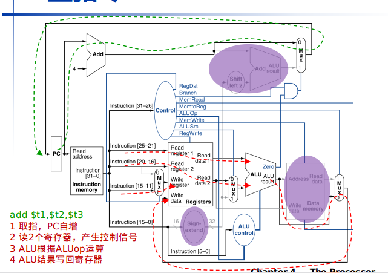

#### 存取指令

 

#### 分支指令

 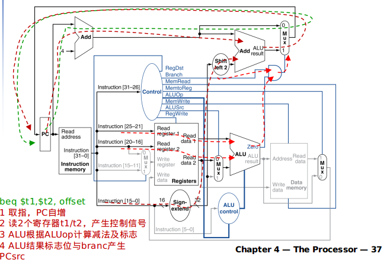 

####控制信号的逻辑实现

 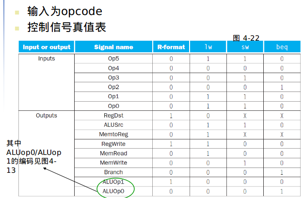

## 4.5 流水线

### MIPS指令流水

5级，每级完成一个操作步骤

+ IF: 从内存中取指令
+ ID: 指令解码& 读寄存器
+ EX: 执行运算或计算地址
+ MEM: 访问内存操作
+ WB: 将结果写回寄存器

### 性能优势

 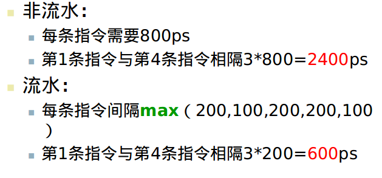

 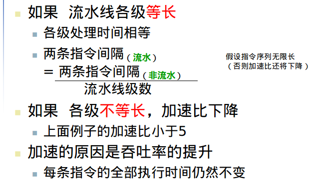

### 面向流水线的ISA设计

+ 所有指令都是32-bits
  + 更容易在一个时钟周期内取指和译码
  + 对比  x86: 1- to 17-byte 指令（以及RISC转换）
+ 指令格式较少、而且很规整
  + 解码的同时就可以读取寄存器操作数，否则增加1级
+ 访存操作仅出现在lw/st指令中
  + 第3级“执行部件”可用于计算地址，供第4级访存使用。否则需要在执行部件和访存之间增加1级地址计算
+ 操作数内存地址对齐
  + 内存访问只需一个周期

### 流水线冒险

冒险现象：下1周期不能按时执行后1条指令

分类：

+ 结构冒险（结构相关）所需的部件忙，暂不可用
+ 数据冒险（数据相关）需要前面某条指令的计算结果，用于本次计算输入
+ 控制冒险（控制相关）需要根据前面某条指令的结果来确定分支的选择执行

#### 结构冒险

+ 某个资源使用的上的冲突
  + 如果MIPS流水实现，且只有一个内存部件
    + 存取操作都需要访问内存
    + 取指令将因此而停顿 引起流水线中的气泡“bubble”
  + 因此，流水实现的MIPS必须有分离独立的指令和数据内存
    + 实际实现中是使用独立的L1 cache而实现

#### 数据冒险

+ 一条指令依赖于前面某条执行的计算结果
+ 解决方法1：编译器安排指令序列——出现太频繁，效果不好
+ 解决方法2：推迟执行，保持因果关系，性能下降
+ 解决方法3：前推/旁路（forwarding/bypassing）
  + 计算结果出来就加以利用,计算结果出来就加以利用
  + 需要从计算结果到“使用处”的额外数据通路

#### 控制冒险

+ 分支将决定控制流
  + 下一条要取出的指令取决于分支指令的输出
  + 流水线未必能取到应该执行的下一条指令
  + 下一条指令IF阶段时，分支指令仍在 ID阶段
+ MIPS 流水中
  + 需要尽早进行寄存器比较运算以及尽快生成目标地址
  + 在分支指令的ID阶段加入硬件，以支持寄存器比较、分支地址计算
+ 解决：分支预测
  + 对分支决策进行预测 预测错误才需要阻塞
  + MIPS指令流水中 预测不跳转的分支 在分支指令之后紧接着取下一条指令，无需阻塞

## 4.6 流水线化的数据通路

